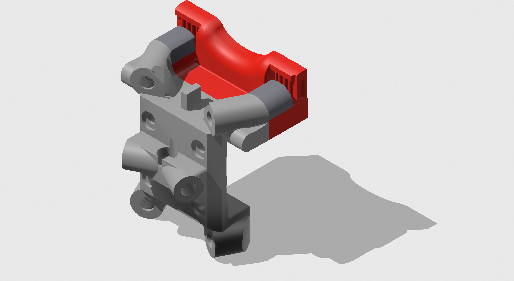

# Tap Changer Custom Parts

This directory contains custom/modded parts to connect the shuttle the a top mount x carriage belt.

Useful for cartesian printers. Some tool head boards may need custom mounts, or a light heat gun on the spacers to bend them up and off the xcarriage for OptoTap to work smoothly.

M3x8mm heat set inserts should be used for the long screws. Drill holes through from back and insert from front of tapchanger_shuttle.